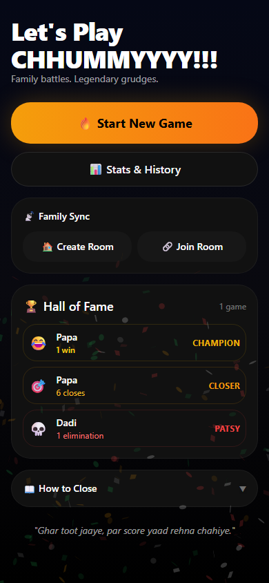
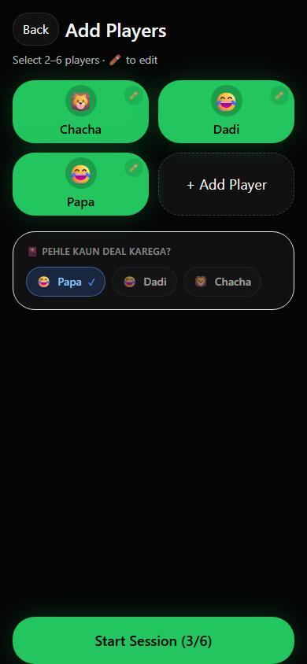
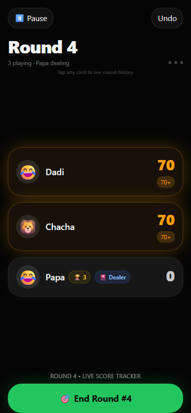
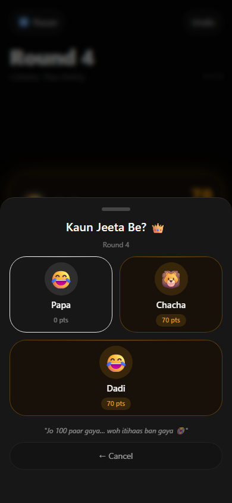
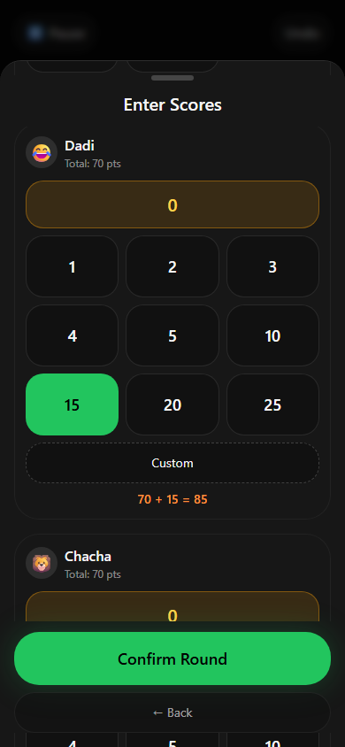
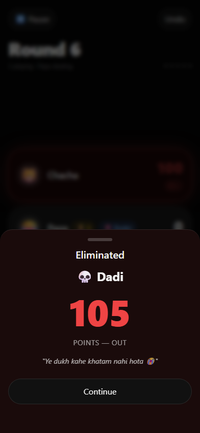
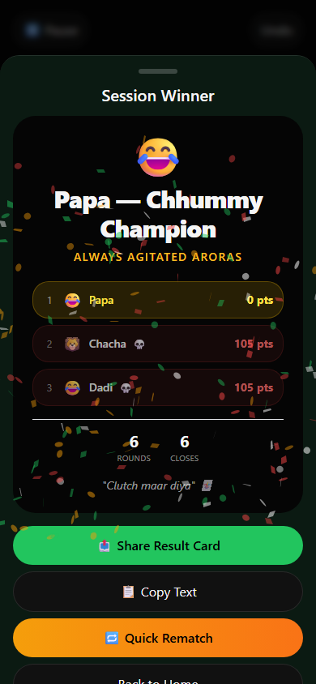
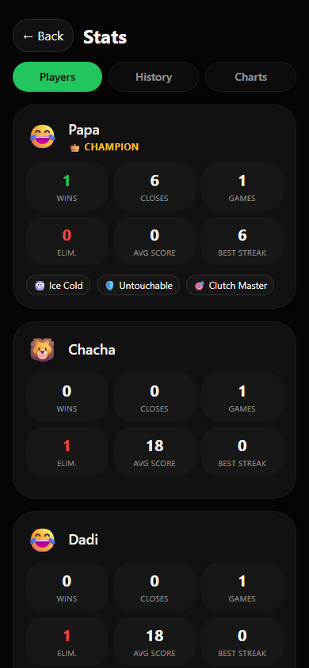
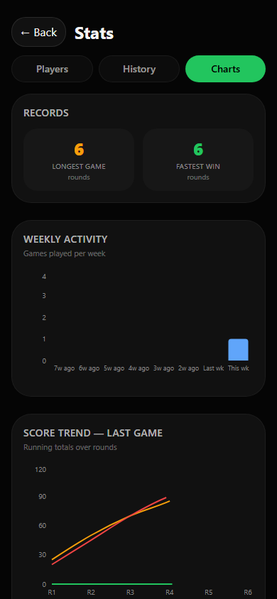

# 🃏 Chhummy Tracker

> **"Ghar toot jaaye, par score yaad rehna chahiye."**

Official score tracker for Arora family Chhummy nights. A premium, mobile-first PWA that handles scoring, eliminations, live multi-device sync, and post-game stats — so nobody argues about the number anymore.

Built with love for the **Always Agitated Aroras**. Runs in the browser, installs to home screen, works offline.

---

## Screenshots

<table>
<tr>
<td align="center" width="200">

<br><sub><b>Home + Hall of Fame</b></sub>
</td>
<td align="center" width="200">

<br><sub><b>Player Setup</b></sub>
</td>
<td align="center" width="200">

<br><sub><b>Live Game (tension!)</b></sub>
</td>
</tr>
<tr>
<td align="center" width="200">

<br><sub><b>Who Closed?</b></sub>
</td>
<td align="center" width="200">

<br><sub><b>Enter Scores</b></sub>
</td>
<td align="center" width="200">

<br><sub><b>Elimination</b></sub>
</td>
</tr>
<tr>
<td align="center" width="200">

<br><sub><b>Winner Celebration</b></sub>
</td>
<td align="center" width="200">

<br><sub><b>Player Stats</b></sub>
</td>
<td align="center" width="200">

<br><sub><b>Score Charts</b></sub>
</td>
</tr>
</table>

---

## The Game — Chhummy Rules

Chhummy is a **6-card variation of Rummy** played by the Arora family. 2–6 players.

### Closing a Round
To close, a player must have:
- At least **one mandatory pure sequence** of 3 cards (no joker)
- The remaining 3 cards can be: another pure sequence, a trail (three of a kind), or **deadwood ≤ 5**

### Scoring
- After someone closes, **all players reveal their hands**
- Each player's remaining hand sum becomes their round score
- The closer's score is their deadwood (0–5)
- **101 or more points = eliminated** (100 is still safe)
- The closer becomes **dealer for the next round**
- **Max 60 points per round** for any non-closer player
- Last surviving player at ≤ 100 wins

### Edge Cases (handled)
- Multiple players can score 0 in the same round
- If all players cross 100 in the same round → lowest total wins; closer breaks the tie

---

## Features

### Core Game Flow
- **Full round flow**: End Round → Who Closed → Score chips → Confirm → Repeat
- **Score chips**: Tap-first UI — 0, 1, 2, 3, 4, 5, 10, 15, 20, 25 + Custom numpad
- **Closer constraint**: Closer sees only chips 0–5 (their deadwood was ≤ 5)
- **Running total preview**: Green → Amber (70+) → Red (85+) → 💀 (101+)
- **Elimination overlay**: Full-screen dark hero when a player crosses 100
- **Winner screen**: Confetti burst + final standings + share card

### Visual Tension
- Cards turn **amber** when a player hits 70+ (danger approaching)
- Cards turn **red with pulse** when a player hits 85+ (critical)
- Eliminated players show **💀 OUT** badge on darkened card
- Trophy badge **🏆 N closes** shown on each player's card

### Undo / Redo
- Undo last round with a confirmation dialog
- Redo available immediately after an undo
- Redo clears when a new round is confirmed (no stale redo)

### Real-Time Family Sync
- **Create Room** — generates a 6-character code and pushes the game to Firebase Firestore
- **Join Room** — any family member enters the code to see the live game on their own phone
- All rounds sync in real-time via `onSnapshot` — no refresh needed
- Tested with 2, 3, and 4 devices simultaneously

### Stats & History
- **Players tab**: wins, closes, eliminations, avg score, best streak, achievement badges
- **History tab**: all past sessions with expandable round-by-round breakdown
- **Charts tab**: score trend line chart, wins per player, closes vs eliminations
- **Head-to-Head**: win/loss records between every pair of players who've played 2+ games together
- **Hall of Fame** on the home screen: Champion, Closer, and Patsy from all-time stats

### Achievements (awarded per game)
| Badge | How |
|---|---|
| 🧊 Ice Cold | Winner finished with 0 total points |
| 🛡️ Untouchable | Winner never reached 70+ at any point |
| 🧗 Survivor | Winner was at 85+ at some point but still won |
| 🎯 Clutch Master | Player who closed the most rounds (unique leader only) |
| 🐑 Patsy | First player to be eliminated |

### Other Highlights
- **Quick Rematch**: restart instantly with the same players
- **Pause screen**: blurred live game behind, mid-game share, end game option
- **Player history sheet**: tap any player card during a game to see their round-by-round breakdown + mini chart
- **Share card**: html2canvas captures a result card → Web Share API / PNG download
- **Copy Text**: copy formatted standings to paste into WhatsApp
- **Web Audio API sounds**: C→E→G fanfare on win, sawtooth on elimination
- **Haptic feedback**: vibration patterns for wins, eliminations, chip taps
- **PWA**: installable to home screen, works fully offline
- **Longest game / fastest win** stats in the History tab

---

## Tech Stack

| Layer | Tech |
|---|---|
| Framework | React 18 + TypeScript (strict) |
| Build | Vite 5 |
| Styling | Tailwind CSS 3 (custom dark theme) |
| State | Zustand 4 |
| Local DB | Dexie 4 (IndexedDB) |
| Cloud Sync | Firebase Firestore (`asia-south1`) |
| Animation | Framer Motion 11 |
| Icons | Lucide React |
| Charts | Recharts |
| Share Card | html2canvas |
| Confetti | canvas-confetti |
| PWA | vite-plugin-pwa |

---

## Running Locally

```bash
git clone https://github.com/kushagraarora997/ChhummyScoreTrackerApp.git
cd ChhummyScoreTrackerApp
npm install
npm run dev
```

Open `http://localhost:5173` in Chrome. For real phone testing, find your local IP via `ipconfig` and open `http://192.168.x.x:5173` from any phone on the same WiFi.

### Build

```bash
npm run build
```

Outputs a production PWA to `dist/`. Deploy anywhere that serves static files.

---

## Deployment

Linked to **Vercel** for automatic deployment. Every push to `main` deploys instantly.

---

## Project Structure

```
src/
  app/App.tsx           # Route manager (splash | home | setup | live | stats)
  pages/                # Full-screen page components
  components/
    overlays/           # WhoClosed, EnterScores, Elimination, Winner, Pause
  store/useAppStore.ts  # All game state via Zustand
  db/
    index.ts            # Dexie schema
    operations.ts       # All IndexedDB access (16 named functions)
  lib/
    firebaseSync.ts     # pullFromCloud, pushToCloud, subscribeToRounds
  utils/
    sound.ts            # Web Audio API sounds
```

---

*Made with chai, cards, and competitive spirit. — Always Agitated Aroras 🃏*
